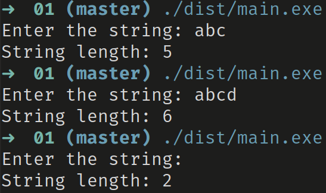

# Длина строки

## Назначение программы

**Поиск длины строки, введеной в консоль. За символ принимается один байт**

## Использование:

После запуска, программа выводит в консоль `Enter the string:` и ожидает ввода строки пользователем.
После того, как пользователь введет строку, в консоль выведется информация о ее длине в формате `String length: [ДЛИНА СТРОКИ]`

Стоит обратить внимание, что в стандартной консоли Windows, строка передается в программу после нажатия клавиши `Enter`, вследствие чего ко всем введеным строкам добавляются символы переноса строки (`\r\n`), а значит программа выведет длину строки на два больше, чем количество видимых символов (см. раздел отладка)

## Тестирование:

Были проведены следующие тесты (см. рисунок 1):

### Тест 1:

Введеная строка: "abc"  
Ожидаемый результат: 5  
Фактический результат: 5

### Тест 2:

Введеная строка: "abcd"  
Ожидаемый результат: 6  
Фактический результат: 6

### Тест 3:

Введеная строка: ""  
Ожидаемый результат: 2  
Фактический результат: 2

## Отладка:

<!--TODO:-->
