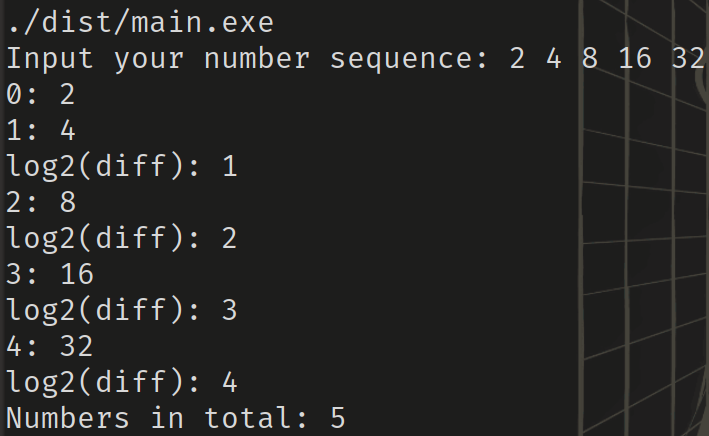
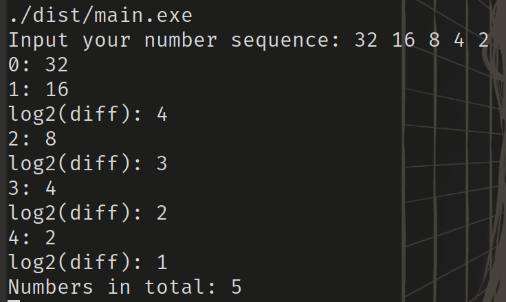
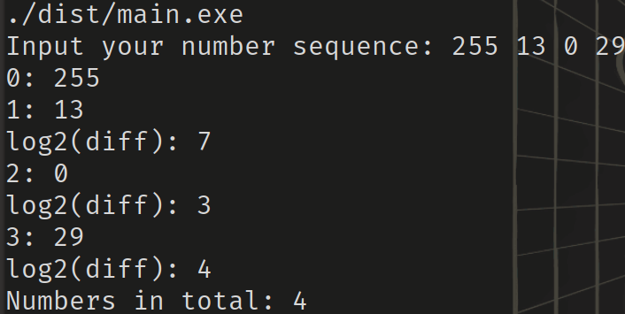

# Поиск максимального порядка разницы

## Назначение программы

**Поиск порядка разницы двух соседних значений в массиве чисел**

## Использование:

После запуска, программа выводит в консоль `Input your number sequence:` и ожидает ввода массива 32-х битных чисел, разделенного пробелами.
После того, как пользователь введет строку, в консоль будут выводиться числа в формате `[ИНДЕКС]: число`, а так же порядок их разницы в формате `log2(diff): [РАЗНИЦА]`. После этого программа выведет количество чисел в массиве в формате `Numbers in total: [КОЛ-ВО ЭЛЕМЕНТОВ В МАССИВЕ]`

## Тестирование:

Были проведены следующие тесты (см. рисунки 1-3):

### Тест 1:

Введеная строка: "2 4 8 16 32"

Ожидаемый результат: `0: 2
1: 4
log2(diff): 1
2: 8
log2(diff): 2
3: 16
log2(diff): 3
4: 32
log2(diff): 4
Numbers in total: 5`

Фактический результат: `0: 2
1: 4
log2(diff): 1
2: 8
log2(diff): 2
3: 16
log2(diff): 3
4: 32
log2(diff): 4
Numbers in total: 5`

### Тест 2:

Введеная строка: "32 16 8 4 2"

Ожидаемый результат: `0: 32
1: 16
log2(diff): 4
2: 8
log2(diff): 3
3: 4
log2(diff): 2
4: 2
log2(diff): 1
Numbers in total: 5`

Фактический результат: `0: 32
1: 16
log2(diff): 4
2: 8
log2(diff): 3
3: 4
log2(diff): 2
4: 2
log2(diff): 1
Numbers in total: 5`

### Тест 3:

Введеная строка: "255 13 0 29"  
Ожидаемый результат: `0: 255
1: 13
log2(diff): 7
2: 0
log2(diff): 3
3: 29
log2(diff): 4
Numbers in total: 4`
Фактический результат: `0: 255
1: 13
log2(diff): 7
2: 0
log2(diff): 3
3: 29
log2(diff): 4
Numbers in total: 4`

