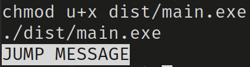
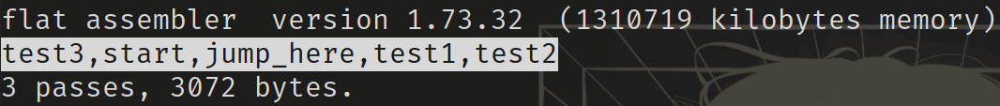

# Определение макросов для создания и печати списка меток

## Назначение программы

**Создание макросов для добавления и управления метками в коде, а также для их печати**

## Использование:

После запуска, программа создает и управляет метками с помощью определенных макросов, добавляя их в список и печатая их в консоль.

Программа использует макросы new_label и prepend_label для создания новых меток и добавления их в список меток.
Макрос print_labels выводит все созданные метки в консоль.

## Описание макросов:

-   new_label: Создает новую метку и добавляет ее в конец списка меток.
-   prepend_label: Создает новую метку и добавляет ее в начало списка меток.
-   print_labels: Печатает все метки, находящиеся в списке.

## Тестирование:

Тест 1:

Действие: Создание метки start и выполнение перехода на метку jump_here.
Ожидаемый результат: Сообщение "JUMP MESSAGE" должно быть напечатано после старта программы, так как был выполнен переход на jump_here.
Фактический результат: Сообщение "JUMP MESSAGE" было успешно напечатано.

Тест 2:

Действие: Печать списка меток после добавления метки test3 в начало списка.
Ожидаемый результат: При ассемблировании программы должен быть напечатан список меток: test3, start, jump_here, test1, test2.
Фактический результат: Список меток напечатан в правильном порядке.

