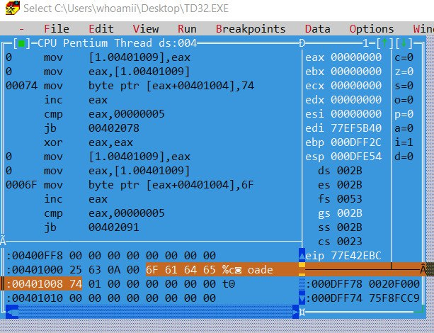

# Программа для работы с кольцевым массивом

## Назначение программы:

**создание макросов для создания записи и чтения данных из кольцевого массива.**

## Использование

После запуска программа выполняет следующие действия:

-   Создает кольцевой массив arr размером 5 байт.
-   Записывает символы в массив с помощью макроса CircleArr_write.
-   Читает и выводит символы из массива с помощью макроса CircleArr_read.
-   Поведение кольцевого массива демонстрируется через переполнение, когда новые данные перезаписывают самые старые.

Описание макросов:

-   NewCircleArr NAME, SIZE, ELEM_SIZE:

Создает кольцевой массив с заданным размером и размером элемента.
Инициализирует указатели на чтение и запись.

-   CircleArr_write NAME, VAL:

Записывает значение VAL в текущую позицию записи массива.
Автоматически перемещает указатель на следующую позицию.
При достижении конца массива возвращается в начало.

-   CircleArr_read NAME:

Читает текущее значение из массива и выводит его на экран.
Автоматически перемещает указатель чтения на следующую позицию.
При достижении конца массива возвращается в начало.

## Тестирование:

Были проведены следующие тесты (см. рисунки 1-3):

### Тест 1:

Действие: Запись символов 'C', 'a', 'd', 'e', 't' в кольцевой массив.
Ожидаемый результат: Все символы успешно записаны в массив.
Фактический результат: Символы записаны без ошибок.

### Тест 2:

Действие: Переполнение массива путем записи дополнительного символа 'o', который должен перезаписать первое значение 'C'.
Ожидаемый результат: Первое значение в массиве перезаписано на 'o'.
Фактический результат: Перезапись прошла успешно, 'C' заменен на 'o'.

### Тест 3:

Действие: Был создан массив с размером элемента 2 байта
Ожидаемый результат: Был создан массив элементов по 2 байта, все операции с массивом проводятся так же
Фактический результат: Был создан массив элементов по 2 байта, все операции с массивом проводятся так же

## Отладка

Была проставлена точка останова перед записью последнего символа в кольцевой массив.
На рисунке 1 представлено содержание массива в этот момент

После этого действие программы было возоблено до полной остановки. Содержание
массива на момент окончания выполнения программы указано на рисунке 2. Как можно увидеть, первый элемент массива был перезаписан, что соответствует ожиданиям

После этого код программы был изменен: вызовом макроса `NewCircleArr arr, 5, 2` был создан массив с размером элемента - 2 байта. После этого программа была запущена снова. На рисунке 3 показан массив после выполнения программы. Как можно заметить, каждый элемент массива теперь занимает 2 байта, но вывод программы в консоль не изменился, что свидетельствует о корректном выполнении программы

